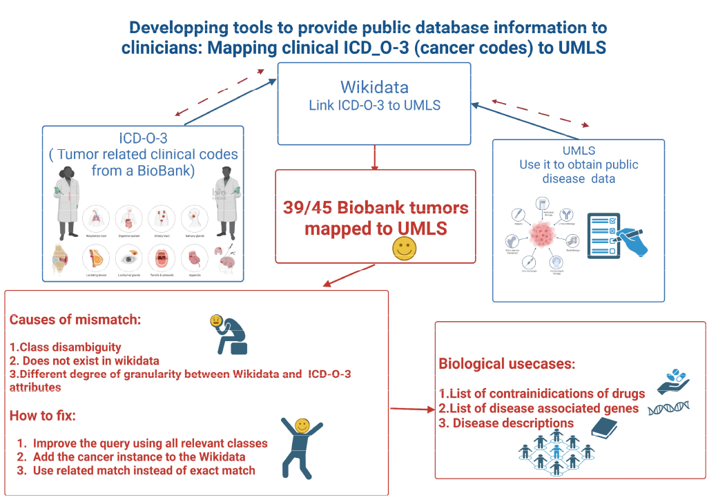

<!--

The paper.md, bibtex and figure file can be found in this repo:

  https://github.com/journal-of-research-objects/Example-BioHackrXiv-Paper

To modify, please clone the repo. You can generate PDF of the paper by
pasting above link (or yours) in

  http://biohackrxiv.genenetwork.org/

-->

# Introduction
As part of the Biohackathon - SWAT4HCLS 2023 in Basel Switzerland, we formed a working group on use cases on linked data.

Linked data:
Using URI's to find overlapping concepts across data sources.
This enriches both datasets.
Linked data is queried in this project using SPARQL.
The linked data that is queried involves: Wikidata, UMLS and the Linked Life Data inventory from GraphDB (Ontotext).

One of the challenges in this project are the ICD-O-3 codes used by clinicians. This is because these codes are not widely adopted in public databases. We make use of the Clinical Cancer community through their contributions in Wikidata by identifying more commonly used URI's in public databases by SPARQL querying ICD-O-3 codes.
See figure [slide] for an overview of the workflow, results and discussion performed at the biohackathon.



The task was to extract structured descriptions of diseases encoded in ICD-O and linked information. We decided to use Wikidata to extract the mappings between ICD-O and UMLS as follows:

1. We constructed a mapping graph by querying the public SPARQL endpoint of Wikidata to extract all concepts classed as Disease having an ICD-O code. In this mapping we assign the corresponding ICD-O resource to the disease using the exactMatch predicate from SKOS:

PREFIX skos: <http://www.w3.org/2004/02/skos/core#>
CONSTRUCT
{
    ?disease skos:exactMatch ?icdoCode
}
WHERE{
SELECT DISTINCT ?disease (URI(CONCAT('http://purl.bioontology.org/ontology/ICDO/', ?icdo)) AS ?icdoCode) #?itemLabel 
WHERE 
{
  ?disease wdt:P31 wd:Q112193867 ; # class of disease
        wdt:P563 ?icdo .
}
}

The result we downloaded as the attached WikiData_2_ICDO.trig file which we then imported into the demo instance of the LinkedLifeData Inventory at https://lld-inventory.ontotext.com/swat4hcls/graphdb as https://lld-inventory.ontotext.com/swat4hcls/graphdb/resource?uri=http%3A%2F%2Flinkedlifedata.com%2Fsemantic-mappings%2Finstance%2Fwikidata-exactmatch-icdo&role=context
2. We constructed a second mapping graph by querying the public SPARQL endpoint of Wikidata to extract all concepts classed as Disease having an UMLS code. In this mapping we assign the corresponding UMLS resource to the disease using the exactMatch predicate from SKOS. Note that in this case we are constructing the UMLS code as a LinkedLifeData resource since UMLS is already loaded in LinkedLifeData:
PREFIX skos: <http://www.w3.org/2004/02/skos/core#>
CONSTRUCT
{
    ?disease skos:exactMatch ?umlsCode
}
WHERE{
SELECT DISTINCT ?disease (URI(CONCAT('https://linkedlifedata.com/resource/umls/id/', ?umls)) AS ?umlsCode) #?itemLabel 
WHERE 
{
  ?disease wdt:P31 wd:Q112193867 ; # class of disease
        wdt:P2892 ?umls
}
}
The result we downloaded as the attached WikiData_2_UMLS.trig file which we then imported into the demo instance of the LinkedLifeData Inventory at https://lld-inventory.ontotext.com/swat4hcls/graphdb as https://lld-inventory.ontotext.com/swat4hcls/graphdb/resource?uri=http%3A%2F%2Flinkedlifedata.com%2Fsemantic-mappings%2Finstance%2Fwikidata-exactmatch-umls&role=context
Now, having "jumped" from ICD-O to UMLS via the WikiData concept we are ready to query the LinkedLifeData for more information about the condition encoded with the specific ICD-O code. Note that we could've chosen to go straight to this part by using a federated query that would perform the mapping "live" on query.wikidata.org but we were advised against doing so in order not to overload the WikiData SPARQL endpoint.
Below are 2 sample queries on LinkedLifeData.
1. Extracting concept definitions and labels:
PREFIX skos: <http://www.w3.org/2004/02/skos/core#>
select ?wikidata ?icdo ?umls ((GROUP_CONCAT(?label; separator="; ")) AS ?labels) ((GROUP_CONCAT(?definition; separator="; ")) AS ?definitions)
where {
    graph <http://linkedlifedata.com/semantic-mappings/instance/wikidata-exactmatch-icdo> {
        ?wikidata skos:exactMatch ?icdo
    }
    graph <http://linkedlifedata.com/semantic-mappings/instance/wikidata-exactmatch-umls> {
        ?wikidata skos:exactMatch ?umls 
    }
    OPTIONAL{?umls skos:prefLabel|skos:altLabel ?label}.
    OPTIONAL{?umls skos:definition ?definition}
} GROUP BY ?wikidata ?icdo ?umls
2. Extracting gene-disease relations:
PREFIX skos: <http://www.w3.org/2004/02/skos/core#>
PREFIX umls_rel: <https://linkedlifedata.com/resource/umls/relation/>
select distinct ?icdo ?label ?umls ?relation ?inter ?interLabel 
where {
    VALUES ?relation {umls_rel:gene_product_malfunction_associated_with_disease umls_rel:gene_mapped_to_disease umls_rel:gene_involved_in_pathogenesis_of_disease umls_rel:associated_genetic_condition}
    GRAPH <http://linkedlifedata.com/semantic-mappings/instance/wikidata-exactmatch-icdo> {
        ?wikidata skos:exactMatch ?icdo
    }
    GRAPH <http://linkedlifedata.com/semantic-mappings/instance/wikidata-exactmatch-umls> {
        ?wikidata skos:exactMatch ?umls 
    }
    ?umls ?relation ?inter .
    ?umls skos:prefLabel ?label .
    ?inter skos:prefLabel ?interLabel .
}
Both queries, and more, can be executed by copying and pasting in the SPARQL editor on that same instance. Navigate to https://lld-inventory.ontotext.com/swat4hcls/graphdb/sparql and login with swat4hcls_3:2023_hackathon. We've saved both sample queries for convenience in GraphDB - you will find them in the list under the Save icon in the SPARQL editor.

# template text:
As part of the one week Biohackathion 2019 in Fukuoka Japan, we formed
a working group on logic programming for the biomedical sciences.
Logic programming is understood by many bioinformaticians when it is
presented in the form of relational SQL queries or SPARQL
queries. More advanced logic programming, however, is underutilized in
bioinformatics.  Prolog, for example, is a high-level programming
language that has its roots in first-order logic or first-order
predicate calculus.  Another example, miniKanren, is an embedded
Domain Specific Language for logic programming. Core miniKanren is
exceptionally simple, with only three logical operators and one
interface operator [@uses_method_in:reasoned2nd].


The introduction of logic programming is particularly relevant in the
context of multi-model data representations where data can be accessed
in memory as free data structures, but also on disk where data can be
represented as tables, trees (documents), and graphs. In
bioinformatics we can make use of all these different data sources and
have a query engine that can mine them all efficiently.

Logic programming is well-suited for biological research. Essentially,
a researcher writes a number of statements that include variables
representing unknown information.  The logic engine then goes through
the solution space (all data) to find possible matches (see figure
\ref{fig}). Much more detail on the rationale and implementations of
miniKanren and logic programming are well summarized in Byrd's book
\emph{The Reasoned Schemer, Second Edition} [@agreesWith:reasoned2nd], PhD thesis
[@ByrdPhD], and [online](https://www.youtube.com/watch?v=eQL48qYDwp4)
[talks](https://www.youtube.com/watch?v=o3AHnyEf7IE).

The `Logic Programming' working group at the 2019 edition of the
annual Japanese BioHackathon applied logic programming to various problems.
The working group:
\begin{itemize}
\item researched state-of-the-art mapping between graph stores and logic programming;
\item created methods for bridging between SPARQL and in-memory data representations using Prolog;
\item extended the Biolink model;
\item and added Relational Biolink type inference for mediKanren.
\end{itemize}

<!--
# Results
-->

## Research of state-of-the-art logic programming facilities for SPARQL

The working group researched current solutions for combining logic
programming with SPARQL.
[ClioPatria](http://www.semantic-web-journal.net/system/files/swj1074.pdf)
is an in-memory RDF quad-store tightly coupled with SWI-Prolog by Jan
Wielemaker, the main author of SWI-Prolog
[@WielemakerBHO15]. SWI-Prolog is published under a BSD license, and
there even exist bindings for
[ClioPatria and Python](http://wi.hwtk.de/WLP2018/Papers/WLP_2018_paper_4.pdf),
for example, although we were unable to locate the source code. We
think ClioPatria and SWI-Prolog are particularly useful for teaching,
and for (in-memory) semantic web applications. SWI-Prolog comes with
client libraries for SQL and SPARQL queries.

## Accessing biological databases using SPARQLProg

<!--
    State the problem you worked on
    Give the state-of-the art/plan
    Describe what you have done/results starting with The working group created...
    Write a conclusion
    Write up any future work
-->

A number of biological databases make their data available in RDF
format, supporting SPARQL access---for example,
[Uniprot](https://www.uniprot.org/),
[NCBI Pubchem](https://pubchemdocs.ncbi.nlm.nih.gov/rdf) and the
[EBI RDF platform](https://www.ebi.ac.uk/rdf/).
SPARQL provides a subset of what logic programming can do.
However, SPARQL queries lack the property of composability and there is no way to
reuse modular components across queries.  For example, to execute a
range query on a genomic region using the FALDO model [@agreesWith:Bolleman2016]
requires authoring a complex query over many triples. If we then wish
to reuse parts of that query in a more complex query, we have to
manually compose them together.

The working group added codes to
[SPARQLProg](https://github.com/cmungall/sparqlprog) which provides a
way to define modular query components using logic programming.
SPARQLProg is written in
SWI-Prolog and has a Python interface library. All code has been made
available in the example directory of
SPARQLProg which provides
sophisticated mapping of logic queries to SPARQL.

For example, a 4-part predicate `feature_in_range` can be composed
with a binary \
`has_mouse_ortholog` predicate:

```
    feature_in_range(grch38:"X", 10000000, 20000000, HumanGene),
    has_mouse_ortholog(HumanGene, MouseGene)
```

This will compile down to a more complex SPARQL query, and execute it against a remote endpoint.

SPARQLProg now includes bindings for many common biological SPARQL
endpoints. As part of this hackathon we developed codes to access RDF
databases of MBGD [@Chiba2015], KEGG OC, TogoVar, JCM, Allie, EBI
 BioSamples, UniProt, and DisGeNET [@Queralt2016]. Future work includes using these
Prolog codes as building blocks for integrative analysis.

## Extending the Biolink Model

<!--
    State the problem you worked on
    Give the state-of-the art/plan
    Describe what you have done/results starting with The working group created...
    Write a conclusion
    Write up any future work
-->

The [Biolink Model](https://github.com/biolink/biolink-model) (see
above) is a data model developed for representing biological and
biomedical knowledge. It includes a schema and generated objects for
the data model and upper ontology. The BioLink Model was designed with
the goal of standardizing the way information is represented in a
graph store, regardless of the formalism used. The working group
focused on extending this model to support representation of a wide
variety of knowledge.

The following tasks were accomplished as part of the BioHackathon:

\begin{enumerate}
\item Represent datasets and their related metadata
\item Represent family and pedigree information to support clinical knowledge
\item Make the provenance model more rich and descriptive
\end{enumerate}

(note the list is written in embedded LaTeX)

For future work, the group will ensure that the new classes added to
the model will have appropriate mappings to other schemas and
ontologies.

##  Relational Biolink type inference for mediKanren

<!--
    State the problem you worked on
    Give the state-of-the art/plan
    Describe what you have done/results starting with The working group created...
    Write a conclusion
    Write up any future work

* Remote member Nada Amin, Chris Mungall, Deepak Unni, Will Byrd

-->

miniKanren is an embedded Domain Specific Language for logic
programming.  The goal was to implement a relational type inferencer
for the [Biolink Model](https://biolink.github.io/biolink-model/) in
miniKanren, which can be integrated into mediKanren. The working group
added a `yaml` subdirectory to the mediKanren GitHub page, and created
multiple files in https://github.com/webyrd/mediKanren/yaml where
`yaml2sexp.py` generates the `biolink.scm` file which contains an
s-expression version of the Biolink yaml file. `yaml.scm` contains
miniKanren relations, and Chez Scheme code that generates miniKanren
relations based on `biolink.scm`. These are giant miniKanren `conde`
clauses that can be thought of as relational tables.  `yaml.scm` also
contains tests for the relations.

Future work includes:

1. integrating this work into the Racket mediKanren code;
2. integrating with the data categories in the KGs;
3. and creating query editor with decent type error messages, autocompletion,
   query synthesis, etc.

# Discussion

The working group concluded that there is ample scope for logic
programming in bioinformatics. Future work includes expansion of
accessing semantic web databases using SPARQLProg, expanding the
BioLink model, and adding dynamic SPARQL support to miniKanren.

## Acknowledgements

We thank the organizers of the NBDC/DBCLS BioHackathon 2019 for
travel support for some of the authors.

## Supplemental information

We use pandoc flavoured markdown, similar to Rstudio see \url{https://garrettgman.github.io/rmarkdown/authoring_pandoc_markdown.html}.

## Tables and figures

Tables can be added in the following way, though alternatives are possible:

| Header 1 | Header 2 |
| -------- | -------- |
| item 1 | item 2 |
| item 3 | item 4 |

Table: Note that table caption is automatically numbered.


| Term                | MB tools/ontologies using this term | Frequency on Biology Stack Exchange | Search Term         |
|:-------------------:|:-----------------------------------:|:-----------------------------------:|:-------------------:|
| Part | iGEM | 9065 | part + parts |
| Component           | SBOL, SBOLDesigner, SBOLCanvas      | 2163                                | component           |
| Module              | SBOL                                | 311                                 | module              |
| Device              |                                     | 677                                 | device              |
| System              |                                     | 16098                               | system              |
| RBS                 |                                     | 548                                 | rbs                 |
| Ribosome Entry Site | SO                                  | 8                                   | ribosome entry site |

LaTeX table:


\begin{tabular}{|l|l|}\hline
Age & Frequency \\ \hline
18--25  & 15 \\
26--35  & 33 \\
36--45  & 22 \\ \hline
\end{tabular}

## Mermaid graphs

This is an example of embedding a graph


Unfortunately it does not work without the mermaid plugin and that requires headless chrome(?!). If you run the command line version of `gen-pdf` it may be possible to get it to work with the right packages. Please tell us if you succeed.

## References
